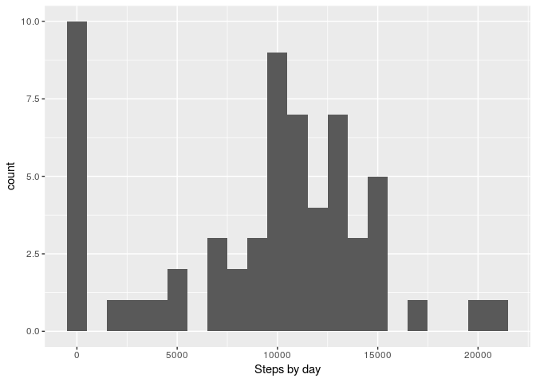
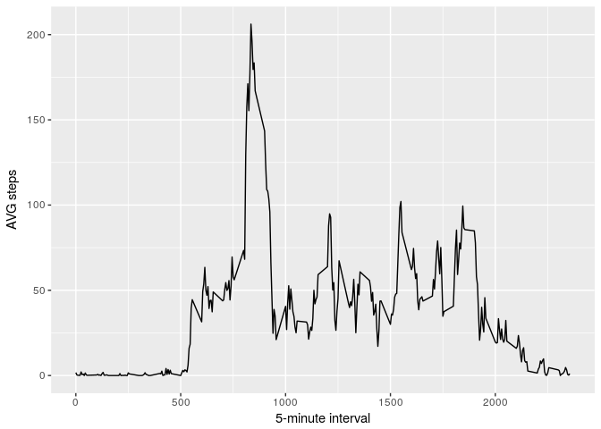
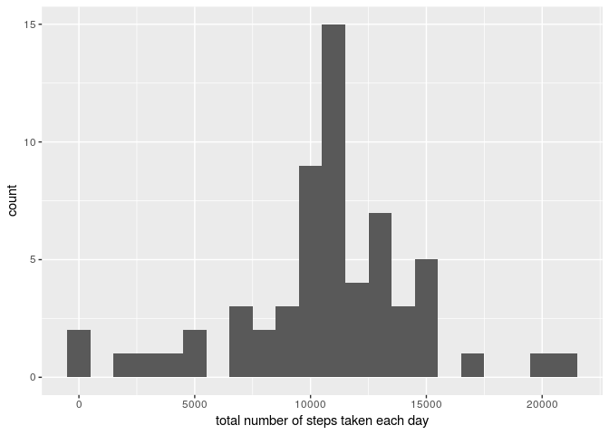
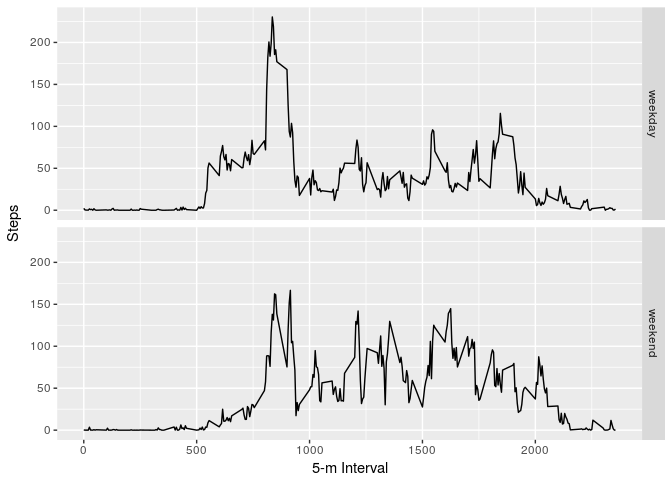

---
title: "test"
output: 
  html_document:
      keep_md: true
---


### Courser RepResearch: Project 01

## Loading and preprocessing the data

```r
if(file.exists("activity.zip")) unzip(zipfile = "activity.zip")
ld_dt <- read.csv("activity.csv")
```


## What is mean total number of steps taken per day?

```r
library(ggplot2)
t_stps <- tapply(ld_dt$steps, ld_dt$date, FUN = sum, na.rm = TRUE)
qplot(t_stps, binwidth = 1000, xlab = "Steps by day")
```

<!-- -->


```r
mean(t_stps, na.rm = TRUE)
```

```
## [1] 9354.23
```


```r
median(t_stps, na.rm = TRUE)
```

```
## [1] 10395
```


## What is the average daily activity pattern?

```r
library(ggplot2)
dt_AVG <- aggregate(x = list(steps = ld_dt$steps), by = list(interval = ld_dt$interval), 
    FUN = mean, na.rm = TRUE)
ggplot(data = dt_AVG, aes(x = interval, y = steps)) + geom_line() + xlab("5-minute interval") + 
    ylab("AVG steps")
```

<!-- -->

# On average across all the days in the ld_dtset, the 5-minute interval contains the maximum number of steps?


```r
dt_AVG[which.max(dt_AVG$steps), ]
```

```
##     interval    steps
## 104      835 206.1698
```


## Imputing missing values


```r
missing <- is.na(ld_dt$steps)
# How many missing
table(missing)
```

```
## missing
## FALSE  TRUE 
## 15264  2304
```


```r
# Replace each missing value with the mean value of its 5-minute interval
fill.value <- function(steps, interval) {
    filled <- NA
    if (!is.na(steps)) 
        filled <- c(steps) else filled <- (dt_AVG[dt_AVG$interval == interval, "steps"])
    return(filled)
}
n_ld_dt <- ld_dt
n_ld_dt$steps <- mapply(fill.value, n_ld_dt$steps, n_ld_dt$interval)
```


```r
t_stps <- tapply(n_ld_dt$steps, n_ld_dt$date, FUN = sum)
qplot(t_stps, binwidth = 1000, xlab = "total number of steps taken each day")
```

<!-- -->


```r
mean(t_stps)
```

```
## [1] 10766.19
```


```r
median(t_stps)
```

```
## [1] 10766.19
```


## Are there differences in activity patterns between weekdays and weekends?

Split data based on day.


```r
Sys.setlocale("LC_TIME", "C")
```

```
## [1] "C"
```

```r
n_ld_dt$date <- as.Date(n_ld_dt$date)
n_ld_dt$day <- sapply(n_ld_dt$date, FUN = function(date) {
    day <- weekdays(date)
    if (day %in% c("Monday", "Tuesday", "Wednesday", "Thursday", "Friday")) 
        return("weekday") else if (day %in% c("Saturday", "Sunday")) 
        return("weekend") else stop("invalid date")
})
```


```r
dt_AVG <- aggregate(steps ~ interval + day, data = n_ld_dt, mean)
ggplot(dt_AVG, aes(interval, steps)) + geom_line() + facet_grid(day ~ .) + xlab("5-m Interval") + ylab("Steps")
```

<!-- -->

